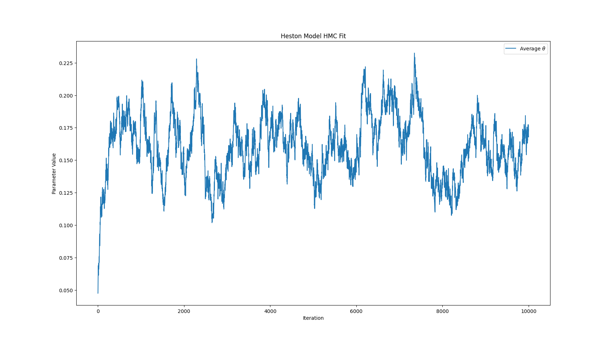

# Deep Reinforcement Learning Market Making Algorithm with Model-Based Planning
## Overview
### Features

### About Me

## Introduction
A *market maker* is someone who actively quotes both buy and sell orders on a security, allowing them to profit off the bid ask spread. Market makers help provide liquidity in financial markets, allowing other investors to easily buy and sell a security that may otherwise see limited trading activity. Market makers face an important set of decisions when their orders are open: the amount of inventory to quote and where to place their buy and sell orders. Executing these decisions poorly can significantly inhibit the market maker's ability to maintain a positive expected value on their spread, especially when there are other firms competing on the same security.

Mathematically speaking, market making is a problem of optimal decision making. The market maker wants to maximize their expected profit from their strategy while hedging their exposure to price movements in the security. An interesting way to solve this problem that leverages cutting-edge machine learning systems is to formulate it as a reinforcement learning problem. In reinforcement learning, we train an agent to explore and exploit an environment and maximize some reward function, overall resulting in the training of an optimal decision maker. There are various problems that must be solved with this approach. One of them is that a reinforcement learning model must study the transitions between states of the market as a result of its actions. Actually acting in the market can be very expensive, and unless you have very high frequency data, training can take many time steps. I will discuss my solution to this problem in the following overview of the model.

## The Model
### Soft Actor-Critic Models
In general, reinforcement learning models learn a policy function $\pi_\theta$ that maps states of the environment to optimal actions that the agent can take to maximize its reward. In the context of market making, we teach the model to devise limit orders that maximize its reward function when receiving actual market data.

Soft actor-critic (SAC) models are special because they attempt to maximize a tradeoff between reward and entropy. This means that the model tries to learn policies that get a high reward but also stay as random as possible. For environment reward $r(s_t, a_t)$, policy entropy (at $s_t$) $H(\pi(\cdot|s_t)) = -E[\text{log}(\pi((a_t|s_t)))]$, and regularization parameter $\alpha$ controlling exploration versus exploitation, we maximize:
$$
\begin{aligned}
    J(\pi) = \sum_t E_{(s_t, a_t) \sim \pi}[r(s_t, a_t) + \alpha H(\pi(\cdot|s_t))]
\end{aligned}
$$
The model has the following neural network components:
#### Policy network (Actor)
A stochastic policy fitted using deep learning that samples actions, given a state. This serves as the *actor*, fitting a probability distribution over the potential actions in the environment.

#### Q-Networks (Critics)
The model estimates two Q-functions, which serve as the *critics*. Q-networks endeavor to assess the value of potential actions in the environment. In the context of SAC models, each Q-network "grades" the quality $Q$ of the action. In practice, we balance the parameter updates of these networks across four different Q-networks. Two of these networks are trained directly, and two are "target" networks, which are gradually updated with the parameters of the directly-trained networks. We then use the polyak averaging procedure to average the parameters of the two models:
$$
\begin{aligned}
    \theta_\text{target} \leftarrow \theta_\text{target} \rho + (1 - \rho) \theta
\end{aligned}
$$
This final result is the set of parameters that the target networks will use. This way, the training is greatly stabilized.

## Simulating Transitions
### Hamiltonian Monte Carlo
The model acts in the space as it collects data, so each transition it studies is one resulting from its interaction with the environment. Obviously, in a real trading scenario, there would be some expense associated with this action. With this in mind, at each step, the model will simulate transitions in the environment using the Heston stochastic model. This provides the model additional data on which to train.

To ensure that the simulated data accurately represents transitions that the model may encounter, we need to fit the different Heston model parameters:
- Mean reversion rate of variance process: $\kappa$
- Long-term mean of variance process: $\theta$
- Volatility of variance process: $\sigma$
- Correlation between the asset price path and variance path: $\rho$
- Initial variance: $v_0$

These parameters are fitted via the *Hamiltonian Monte Carlo* (HMC) procedure. Consider a target distribution $p(\boldsymbol{\theta})$, where $\boldsymbol{\theta}$ is our vector of the above parameters. Hamiltonian Monte Carlo allows us to sample from this distribution by simulating Hamiltonian dynamics in the system, resulting in substantially faster MCMC chain generation than typical MCMC regimes, like Metropolis-Hastings or random walk. To do this, we model our vector $\boldsymbol{\theta}$ as a "position" and momentum as normally distributed. The target distribution can be expressed in terms of the potential energy $U(\boldsymbol{\theta})$ as follows:
$$
\begin{aligned}
    p(\boldsymbol{\theta}) \propto \text{exp}(-U(\boldsymbol{\theta}))
\end{aligned}
$$

From Hamiltonian mechanics, we know that the Hamiltonian (or, in a conservative system, the total energy) is given by:
$$
\begin{aligned}
H(\boldsymbol{\theta}, p) = U(\boldsymbol{\theta}) + K(p)
\end{aligned}
$$

By randomly sampling from the standard normal distribution for $p$, we can effectively sample our parameters $\boldsymbol{\theta}$, weighted by where in the Hamiltonian system they are most likely to occur. The evolution is simulated according to Hamilton's equations, which are physically motivated. Gradients of the potential energy are computed using the leapfrog integrator.
$$
\begin{aligned}
    \frac{dp}{dt} = -\frac{\partial H}{\partial\theta}=-\nabla U(\boldsymbol{\theta})
\end{aligned}
$$

In general, the algorithm is:
1. Sample momentum from $N(0, M)$, where $M$ is the mass and usually equals 1.
2. Simulate Hamiltonian dynamics with leapfrog for $L$ steps to compute the parameters $\boldsymbol{\theta}$, given the simulated momentum.
3. Accept/reject new state based on Metrpolis criterion.
4. Add $\boldsymbol{\theta}$ to the array of sampled thetas.

### Results
The Heston surface does not have a closed form, so sampling the parameters via HMC is a good choice. Generally, for each parameter, you should notice that after some exploration of the space, the parameter estimates settle on a stationary distribution. Consider the following example for the long term mean $\theta$ of the variance process:

After a spike at around 7500 steps, it seems to converge nicely after 10000 steps. Convergence can be sped up if simulating many chains in parallel using multiprocessing and averaging the results, as seen below:

The $\theta$ estimate seems to explore a smaller space now, and it converges much more quickly.

## Overall Takeaways
Overall, this project was a good way to acquaint myself with multiple mathematical methods for analyzing market data from a market maker's perspective. Unfortunately, the SAC model requires a considerable amount of data to begin to be profitable, so I was unable to show any numerical results. Nevertheless, the model does run quite well, even on my old laptop, and I am proud of the results it can achieve on its own. Please reach out to [tgore@nd.edu](mailto:tgore@nd.edu) if you have any inquiries about this project or would like to set up an interview.

*Disclaimer: this project was constructed solely for academic purposes as a way for me to showcase my knowledge of machine learning and data analysis. No part of this project constitutes financial advice. If you deploy this model live, you assume all risks relating to stock trading.*